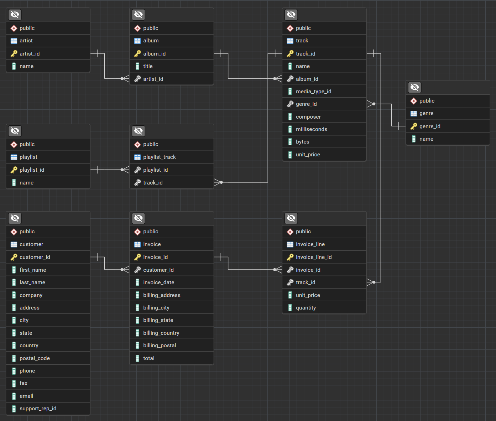
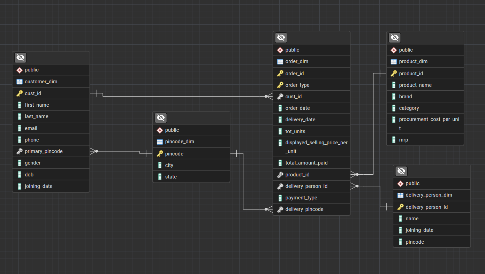

# DeepDive-SQL-Analysis

This project demonstrates the use of PostgreSQL to analyze data in two different scenarios: **Music Store Analysis** and **Sales Analysis**. Through these analyses, various SQL techniques are applied, including aggregation, grouping, Common Table Expressions (CTEs), and subqueries, to extract valuable insights from the data.

## Project Structure

- **Music Store Analysis**:
  - **Data Source**: Full database imported.
  - **Description**: A comprehensive analysis of a music store's data to gain insights into sales patterns, customer behavior, and inventory management.
  - **Techniques Used**: Group By, Aggregations, Joins.
  - **ERD**:

    

- **Sales Analysis**:
  - **Data Source**: Data imported from CSV files to tables.
  - **Description**: A focused analysis on sales data, exploring trends, returns, and performance metrics across various product categories and brands.
  - **Techniques Used**: Group By, Aggregations, Joins, CTEs, Subqueries.
  - **ERD**:

    

## Tools and Environment

- **Database**: PostgreSQL
- **Database Management**: pgAdmin (for database import, schema management, and ERD generation)
